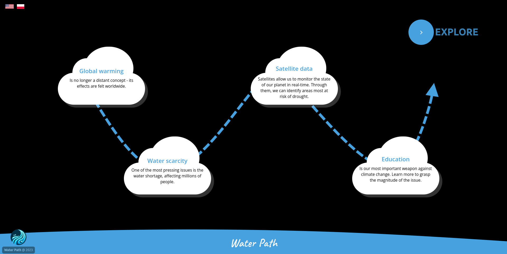

# Water Path

Visualizing Climate Impact on Water Resources

## Demo

https://water-path.vercel.app/

## Description

WaterPath is a web application written in ReactJS that is designed to educate young minds about the impact of climate change and human activities on water resources. It visualizes satellite images to show changes in water bodies over time. Using Artificial Intelligence we customize educational content based on user’s level of education.

## Screenshots

 
 
 

## Key features

- Satellite Image Comparison
  This feature allows users to compare two satellite images side-by-side, offering both visual and numerical insights into how water surfaces have changed over time. Users can select specific dates to visualize the changes, making it an invaluable tool for understanding the impact of climate change on water bodies.

- Case Selection: Jezioro Wiliczyńskie and Lake Chad
  Our application provides the option to choose between two different cases: Jezioro Wiliczyńskie and Lake Chad. This feature aims to offer a more comprehensive understanding of how different geographical locations are affected by climate change, thereby broadening the user's perspective. 

- Side Panel with Educational Information
  A side panel is integrated into the application, providing educational content that includes a description of the water issue at hand, real-time news articles sourced from the internet, news summaries, and an explanation of how the data aiding the visualization was obtained. This feature enriches the user's learning experience by offering contextual information.

- AI-Adaptive Educational Content
  One of the standout features is the AI-based adaptation of educational content. With a single button, the application adjusts the complexity of the educational material based on the user's educational level (K-6/K-9/K-12). This ensures that the information is both accessible and challenging for users of different ages and  educational backgrounds.

## How it works

The application allows users to compare satellite images from different dates side-by-side. It also provides summarized news articles and additional information to offer context and deeper understanding. We show selected water problems, provide explanations for them, show news about each of them with the generated summary and provide explainers about source of satellite data that was used to tell the story.

## Technical details

### Data Sources and Preprocessing

#### Sentinel Data

We utilized Sentinel satellite data that has been processed through the Copernicus program. The data is published as an NDWI (Normalized Difference Water Index) data product, which is a standard metric for identifying water features in satellite imagery.

#### LandSat Data

In addition to Sentinel data, we also used LandSat data with manually downloaded multispectral data. We calculated the NDWI index manually using Python scripts in a Jupyter Notebook environment.

#### Data Analysis and Processing

#### NDWI Index

The NDWI index is used to differentiate water bodies from land in satellite images. It's calculated using the Green and Near-Infrared (NIR) bands of the satellite image.

#### DBScan Clustering

We employed the DBScan clustering algorithm to identify and cluster lakes that were the target for our application. This method is particularly effective for spatial data and helped us isolate the water bodies of interest.

#### Area Calculation

The areas for our target lakes were calculated using the clusters generated by DBScan and resolution information extracted from the satellite files' metadata.

#### Python Libraries Used

- Pandas: For data manipulation and analysis.
- Rasterio: To read and write geospatial raster data.
- Scikit-learn: For implementing the DBScan clustering algorithm.
- Sentinelsat: To search, download, and retrieve Sentinel satellite images.
- Matplotlib: For plotting and visualizing the data for internal purposes and manual data verification.

### Web Application Development

#### ReactJS

Our web application was developed using ReactJS, a popular JavaScript library for building user interfaces.

#### Vercel

We used Vercel for deploying and scaling our web application. Vercel provides a cloud platform for static sites and Serverless Functions.

#### TailwindCSS

For styling and creating compelling visuals, we used TailwindCSS, a utility-first CSS framework.

#### NodeJS

The architecture of our web application is built on NodeJS, which allows for a scalable and efficient application.

#### NextUI

We used NextUI for reusable, accessible, and interactive components, enhancing the user experience.

### Artificial Intelligence

Artificial Intelligence plays a pivotal role in enhancing the capabilities and user experience of our application. Below are the key areas where AI has been integrated:

#### News Summarization

We employ LLM Prompting techniques to summarize news articles related to each case of water change. This enables us to provide concise, relevant information tailored to different educational levels (K-6/K-9/K-12).

#### Adaptive Learning

Our application uses AI to adapt the learning experience based on user interaction. For example, the complexity of news summaries and metadata can be adjusted according to the selected educational level.

#### Visuals

We used DALL-E to create placeholder graphics in our application and the application logo.

### Content Creation

We used OpenAI’s ChatGPT-4 to help use prepare content for project submission, video presentation narrative and supplementary materials.

### Space Agency Data

We utilized NASA's LandSat Earth Observation satellite constellation. We downloaded selected data with defined by us locations through USGS satellite data access service. We specifically used Landsat Collection 2 Level-1 Data. For our task we used Spectral Bands in Cloud Optimized GeoTIFF files (using bands 03 and 05). Data was processed by our own scripts that calculated NDWI (Normalized Difference Water Index - more on that in technical details section).

We also used ESA’s Sentinel Earth Observation satellite constellation. For data download we used web based DataSpace Copernicus application (https://dataspace.copernicus.eu/). Here we used already provided processing (specifically maps with NDWI indexes). We processed them to calculate water areas in targeted lakes from different times.

These data sets helped us visualize and understand how freshwater resources are changing over time due to climate change and human activity.
